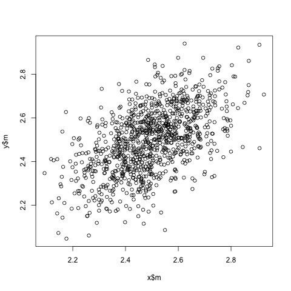

# Why analysis of stratified randomization trial data need to account for the stratification factors?

> The use of stratified randomization induces a dependence in the data between patients. As the [BMJ article ](http://www.bmj.com/content/345/bmj.e5840)graphically illustrates, the treatment specific means are positively correlated when considering running repeated trials. It turns out that the consequence of this non-independence is that if one analyses the trial ignoring the factors used in the stratified randomization, the standard error estimate is larger than it should be. That is, if one uses stratified randomization in order to ensure balance between arms in respect of the baseline variables used in the randomization, and one ignores these baseline variables in the analysis, the benefit in terms of improved precision is not realised in the calculated standard error. The effect of this is that power is lower than it needs to be, and the type 1 error controlled at lower level than intended.

```R
# simulation to demontrate the correlation (in outcome) among subjects from stratified randomization
# for simplicity, this program assumes only two strata defined by one stratification variable; the block size is set to be 4
# assume treatment effect is 0, however it doesn't affect the simulation result
y_bar <- NULL

for (i in 1:1000){ # number of simulations
	n1 = 1
	n2 = 1
	trt1 <- rbinom(1, 1, 0.5) # randomly assign treatment for the first patient in each stratum
	trt2 <- rbinom(1, 1, 0.5) # stratum 2
	y1 <- 1 + 0*trt1 + 3*0 + rnorm(1)
	y2 <- 1 + 0*trt2 + 3*1 + rnorm(1) # effect from x is 3

	while(n1 + n2 < 200){
		x <- rbinom(1, 1, 0.5)
		if (x == 0){
			n1 = n1 + 1
			if (n1 %% 4 == 0) { # block size is set to 8
				trt <- rbinom(1, 1, 0.5)
				y <- 1 + 0*trt + 3*0 + rnorm(1)
				trt1 <- c(trt1, trt)
				y1 <- c(y1, y)
			}
			else {
				trt <- 1 - tail(trt1, 1)
				y <- 1 + 0*trt + 3*0 + rnorm(1)
				trt1 <- c(trt1, trt)
				y1 <- c(y1, y)
			}
		}
		else {
			n2 = n2 + 1
			if (n2 %% 4 == 0) {
				trt <- rbinom(1, 1, 0.5)
				y <- 1 + 0*trt + 3*1 + rnorm(1)
				trt2 <- c(trt2, trt)
				y2 <- c(y2, y)				
			}
			else {
				trt <- 1 - tail(trt2, 1)
				y <- 1 + 0*trt + 3*1 + rnorm(1)
				trt2 <- c(trt2, trt)
				y2 <- c(y2, y)
			}
		}
	} # end of while loop

	df <- data.frame(y = c(y1, y2), trt = c(trt1, trt2), x = c(rep(0, n1), rep(1, n2)))
	out <- df %>% group_by(trt) %>% summarize(m = mean(y))
	y_bar <- bind_rows(y_bar, out)

} # end of for loop

# exam the correlation in the outcome between the treatment groups 
x = y_bar %>% filter(trt ==0) %>% select(m)
y = y_bar %>% filter(trt == 1) %>% select(m)
plot(x$m, y$m)
(cor(x$m, y$m))
# [1] 0.5364252
```



```python
from IPython.display import display, Markdown
display(Markdown(''))
```